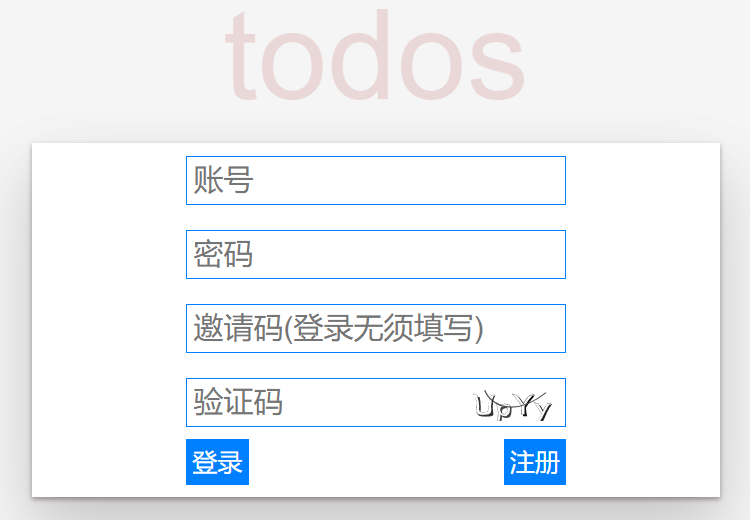
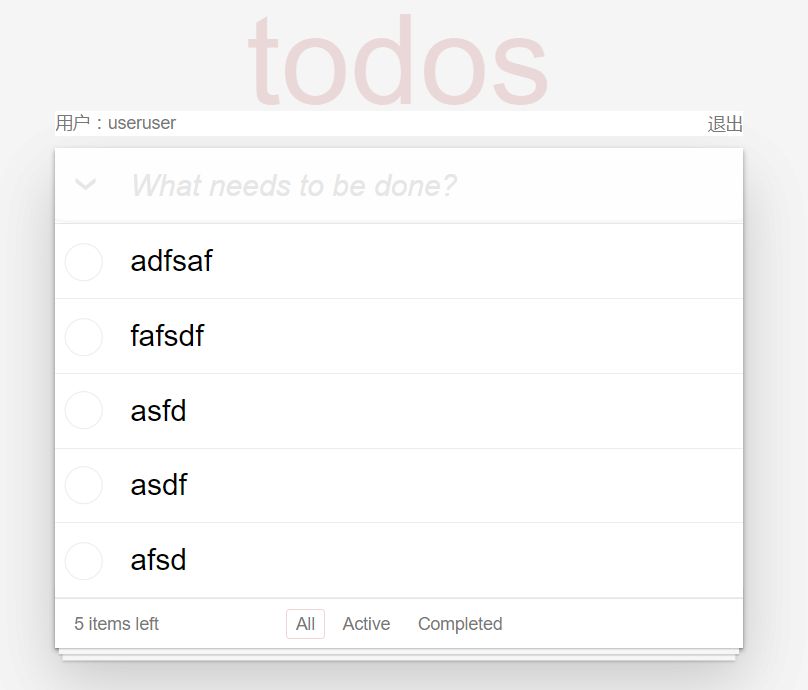

# 自己实现的TodoMVC

## 使用说明：

访问地址：http://118.126.112.224:8080/#/

账号：6-11位

密码：6-11位

邀请码：（注册必填）

在不点击图片的情况下，验证码可以在注册后直接用于登录



正常界面：点击“退出”可以清除登陆状态，正常情况登陆状态的有效期为1小时。




## 安装说明：

进行如下操作时，首先确保你的数据库安装好了！

1. ```cd ./TodoMVC```

2. ```npm install```安装所有依赖

3. ```touch config.js```在项目根目录中添加自己的config.js，(这是为了项目的一些敏感信息不放到git上，)

4. ```vim config.js```填config.js内容，格式如下

   ```json
   const secertKey = 'bytedance'; //这是生成jwt的密钥
   const dbName = '*****'; //你的数据库名称
   const username = '*****';  //数据库用户名
   const password = '*****'; //数据库密码
   const ip = '***.***.***.***'; //数据库ip
   const port = 3306; //数据库端口
   const invitCode = '******';  //为了防止我的注册接口被恶意调用，增加验证邀请码
   
   const serverPort = 8080; //node服务器的端口
   
   //session的key及其他配置
   const sessionConfig = {
       key: '****',
       mazAge: 5 * 60 * 1000,
       autoCommit: true,
       overwrite: true,
       httpOnly: true,
       signed: true,
       rolling: true,
       renew: false
   }
   
   module.exports = {
       secertKey,
       dbName,
       username,
       password,
       ip,
       port,
       sessionConfig,
       invitCode,
       serverPort
   };
   ```

5. 开发环境

   1. ```npm run dev``` 会启动一个webpack-dev-server
   2. ```npm run server:dev```会用nodemon启动node服务器
   3. 这两个服务器都支持热更新

6. 生产环境
   1. ```npm run build```会把前端文件打包到dist目录下
   2. ```npm run server:server```会用pm2启动node服务器，并且我在node服务器中监听了```/```路由，会直接返回dist目录下的index.html内容。
   3. 浏览ip+端口即可正常使用。


## 开发文档

### 项目目录

```txt
├── package.json
├── public
│   └── index.html
├── server
│   ├── app.js
│   ├── config
│   │   └── index.js
│   ├── models
│   │   └── User.js
│   ├── routes
│   │   └── index.js
│   ├── utils
│   │   ├── dbUtil.js
│   │   ├── enbcrypt.js
│   │   └── passport.js
│   └── validation
│       ├── isEmpty.js
│       └── register.js
├── src
│   ├── components
│   │   ├── BodyFooter.js
│   │   ├── Body.js
│   │   ├── Header.js
│   │   ├── MainPage.js
│   │   ├── TheInput.js
│   │   ├── TodoItem.js
│   │   ├── TodoList.js
│   │   ├── UserInfo.js
│   │   └── User.js
│   ├── index.js
│   ├── index.less
│   ├── reducer
│   │   └── index.js
│   ├── store
│   │   └── index.js
│   └── utils
│       ├── docCookies.js
│       └── enbcrypt.js
├── webpack.dev.js
└── webpack.prod.js
```


### 前端部分

前端部分的代码主要在src目录下

1. conponents目录下为项目的组件
2. index.js，是webpack打包时的入口文件
3. index.less，是项目的样式文件
4. reducer目录下是action的处理方式
5. store就是初始化redux的store
6. redux中的action放在各个组件被react-redux的connect()的参数中

#### 实现思路：

在前端实现todomvc，我采用的是受控组件的思路。所有组件中，只有Body组件会有自己的state，这个state中的todoList即为我存储的任务list。todoList是一个js的Array类型对象，这个数组的每一项包含一个String类型的value值，和代表这个todoItem是否被完成的done值。

```json
todoList[i] = {
    value: String
    done: Boolean
}
```

而其他组件操作todoList，是根据Body组件传递的props值。

在后端部分实现的过程中，把todoList的来源从localstorage中拿到，改成了从store中获取了。所以代码中的本地存储被我在实现服务器的过程中基本删掉了。

由于这个项目前端路由过于简单，我也没引入react-router


### 后台部分

服务器相关文件目录在server中

服务器采用的技术栈为koa，数据库连接使用sequelize。

#### 实现思路：

前端正常登陆后，在cookies中存储jwt。前端的reducer中的代表登陆状态的isLogin的默认值就是从cookies中拿到jwt字段。服务器设置的jwt和该cookie的有效期为1小时。

#### 配置部分：

config目录下的index.js，引用了在"安装说明"第3步的，config.js内容。

#### 建表部分：

Models目录下为我的数据模型，只有一个User.js。

由于只需要实现用户登录，以及查看用户的todolist，我只建了一张表。（正常来讲，应该建一张用户表，然后一张todolist表，todolist以用户表的id作为外键）

| id   | username | password | todolist      |
| ---- | -------- | -------- | ------------- |
| uuid | char(36) | char(36) | varchar(2048) |

todolist用来存储用户的JSON字符串化的todolist，所以将长度设为很长了。（如果数据库支持，可以直接把该字段设置为JSON类型）

#### 路由部分：

设置的服务器api:

getAuthCode用来获取验证码，这是一个公开接口，值得一提的是在前端给验证码图片设置点击事件，更改图片的src后的随机数来刷新验证码。

```ctx.session.autoCode = authCode.text.toLowerCase();```将验证码放在session中

```javascript
/**
* @route GET api/getAuthCode
* @desc 用户信息接口地址 返回图片验证码
* @access 接口是公开
*/
router.get("/getAuthCode",  async ctx => {

    var authCode = svgCaptcha.create({
        inverse: false,
        fontSize: 36,
        noise: 1,
        width: 80,
        height: 30
    })
    ctx.session.autoCode = authCode.text.toLowerCase();
    ctx.response.set('Content-Type', 'image/svg+xml');
    ctx.response.body = String(authCode.data);
    ctx.response.status = 200;
})
```


register用来注册用户，由于为了防止有人恶意注册，我增加判断了邀请码，同时密码采用加盐的方式存储（前端传来的密码已经是md5加密了，在后台再次加盐后存储）。

```javascript
/**
* @route POST api/register
* @desc 测试接口地址
* @access 接口是公开的
*/
router.post('/register', async ctx => {

    const inputInvitCode = ctx.request.body.invitCode;
    if (!inputInvitCode || (inputInvitCode.toLowerCase() != invitCode)) {
        ctx.response.status = 401;
        ctx.response.body = { "message": '邀请码错误' };
        return;
    }

    const inputAuthCode = ctx.request.body.authCode;
    if (!inputAuthCode || (inputAuthCode.toLowerCase() != ctx.session.autoCode)) {
        ctx.response.status = 401;
        ctx.response.body = { "message": '验证码错误' };
        return;
    }

    let { username, password } = ctx.request.body;

    let user = await User.findOne({
        where: {
            username
        }
    })

    if (user) {
        ctx.response.status = 400;
        ctx.response.body = { "message": '用户名已存在' };
        return;
    }

    await User.create({
        id: uuidv4(),
        username,
        password: enbcrypt(password),
        todolist: `[]`
    }).then(() => {
        ctx.response.status = 200;
        ctx.response.body = { "message": 'OK' };
    }).catch(() => {
        ctx.response.status = 500;
        ctx.response.body = { "message": '注册用户数据库插入失败' };
    })

    return;
})
```


login登录接口，采用```await bcrypt.compareSync(password, user.password);```比对传来的密码加盐后是否和数据库中存储的密码相同。相同时，生成jwt，并返回给前端。

```javascript
router.post("/login", async ctx => {
    const inputeAuthCode = ctx.request.body.authCode;
    if (!inputeAuthCode || (inputeAuthCode.toLowerCase() != ctx.session.autoCode)) {
        ctx.response.status = 401;
        ctx.response.body = { "message": '验证码错误' };
        return;
    }

    const user = await User.findOne({
        where: {
            username: ctx.request.body.username
        }
    })

    const password = ctx.request.body.password;

    if (user) {
        var result = await bcrypt.compareSync(password, user.password);
        if (result) {
            const payLoad = {
                id: user.id,
                username: user.username
            }
            const token = jwt.sign(payLoad, secertKey, { expiresIn: 3600 });
            ctx.status = 200;
            ctx.body = {
                success: true,
                token: 'Bearer ' + token,
                username: user.username,
                todolist: user.todolist
            }
            return;
        }
    }

    //user不存在，或者密码对比不相同
    ctx.response.status = 401;
    ctx.response.body = { message: '用户名或者密码错误' }
    return;
})
```


getList用来返回用户的todoList，这是私密接口，需要请求的authentic头部带有jwt头部

```javascript
/**
* @route GET api/getList
* @desc 用户信息接口地址 返回用户信息
* @access 接口是私密的
*/
router.get("/getList", passport.authenticate('jwt', { session: false }),
    async (ctx) => {
        //utils中的jwt鉴权方式中回调传入的user
        const user = ctx.state.user;
        if (user) {
            ctx.response.status = 200;
            ctx.response.body = {
                todolist: user.todolist || `[]`
            };
        }
        else {
            ctx.response.status = 401;
            ctx.response.body = {message: '用户名已失效'}
        }
    }
)
```


updateList用来更新用户的todoList，这是私密接口，需要请求的authentic头部带有jwt头部

```javascript
/**
* @route GET api/updateList
* @desc 用户信息接口地址 返回用户信息
* @access 接口是私密的
*/
router.post("/updateList", passport.authenticate('jwt', { session: false }),
    async (ctx) => {
        //utils中的jwt鉴权方式中回调传入的user
        const { todolist } = ctx.request.body;
        const user = ctx.state.user;
        if (user) {
            await user.update({
                todolist
            }, {
                where: {
                    username: user.username     
                }
            }).then(() => {
                console.log('update!!!!!!');
                ctx.status = 200;
                ctx.body = { success: true }
                return;
            }).catch(err => {
                ctx.status = 500;
                ctx.body = { message: '数据库更新失败 '}
            })
        }
        else {
            ctx.status = 401;
            ctx.body = { message: '用户名已失效 '}
        }
    }
)
```

